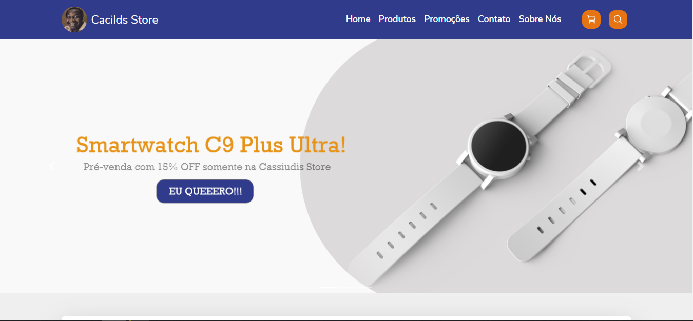
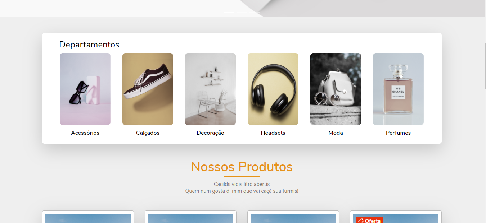
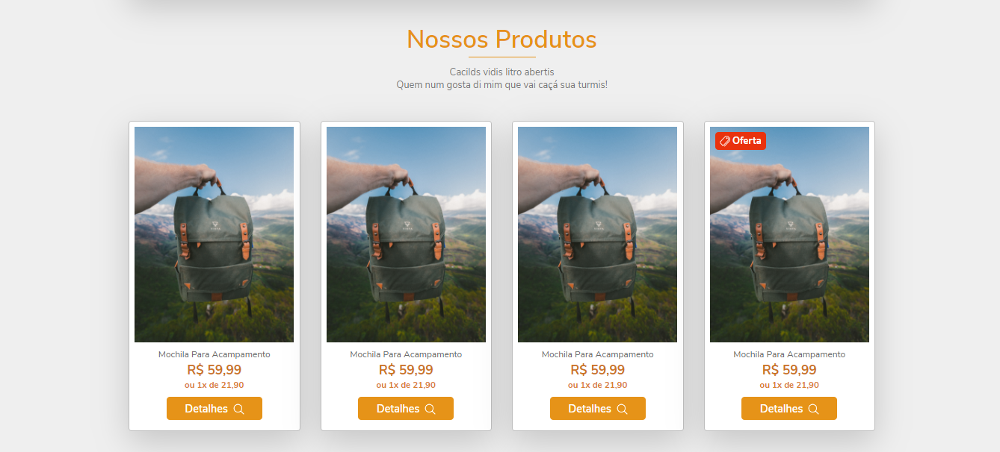
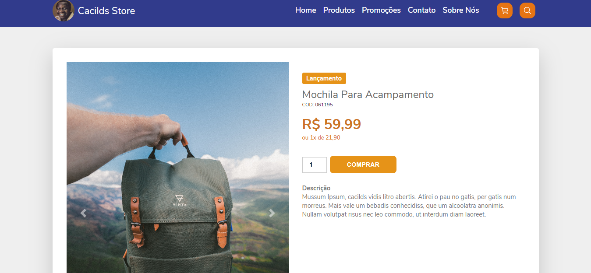

<h1 align="center">
	Desafio Jurunense
</h1>
<p align="center">E-commerce apelidado de Cacilds Store com duas páginas responsivas sendo uma a home e a outra os detalhes do produto utilizando Bootstrap 4</p>

<p align="center">
	 <a href="https://cacilds-store.netlify.app/">
    
  </a>
</p>

<p align="center">
	<kbd>
		
	</kbd>
	<kbd>
		
	</kbd>
	<kbd>
		
	</kbd>
	<kbd>
		
	</kbd>
</p>


🛠 Tecnologias
=================
As seguintes ferramentas foram usadas na construção do projeto:
* HTML5/SCSS
* Bootstrap 4
* Live Server (Inicia um servidor de desenvolvimento local com recurso de recarga ao vivo para páginas estáticas e dinâmicas.)
* Live Sass Compiler (Uma extensão VSCode que ajuda a compilar / transpilar seus arquivos SASS / SCSS para arquivos CSS em tempo real com a atualização ao vivo do navegador)


## :information_source: Como rodar a aplicação

```bash
# Clone this repository
$ git clone https://github.com/aosilvajr/cacilds-store.git

# Go into the repository
$ cd cacilds-store

# Install dependencies
$ npm install

# To run app just open the index.html in any browser or Live Server
```


## Agradecimento
* Agradeço pelo oportunidade de demonstrar um pouco do meu conhecimento espero muito poder fazer parte do time! Obrigado.

**Em caso de dúvidas, envie e-mail para aosilvajr@gmail.com**
